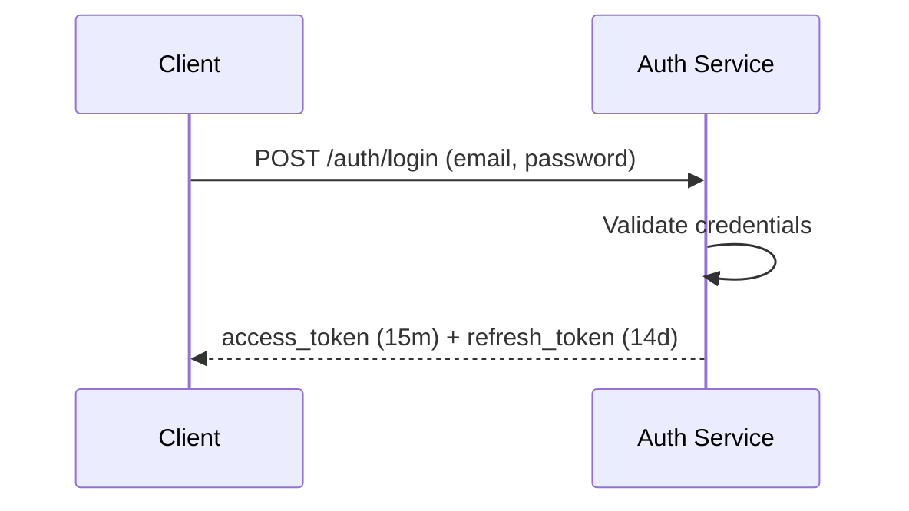
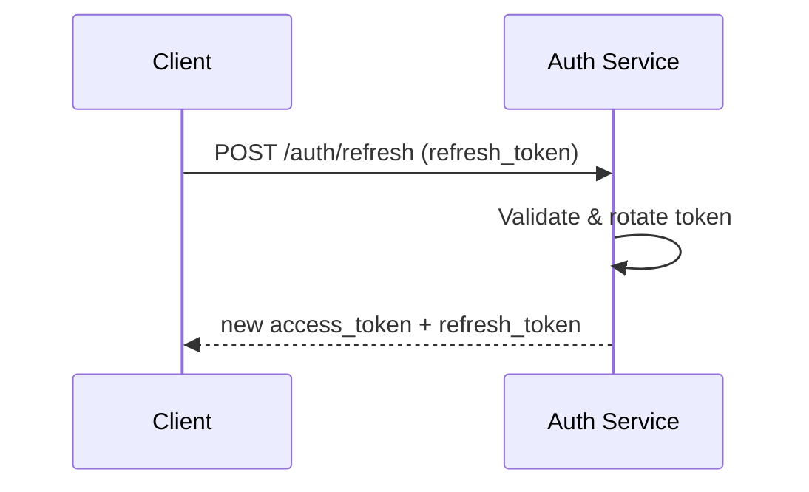

# AuthN/AuthZ Specification

## Registration & Login
- **Registration**: `POST /auth/register` with email and password creates a new user account. Duplicate emails are rejected.
- **Login**: `POST /auth/login` verifies credentials and returns an access and refresh JWT pair.

### Sequence: Login

## Token Refresh & Revocation
- **Access token**: JWT valid for 15 minutes. Encodes `sub`, issued time, and organization claims.
- **Refresh token**: JWT valid for 14 days. Stored server side for rotation and revocation.
- **Rotation**: Each call to `POST /auth/refresh` issues a new refresh token and invalidates the previous one.
- **Revocation**: Logout or administrator action removes refresh tokens from the allow‑list so they can no longer be exchanged.

### Sequence: Refresh

## Roles & Policies
Users belong to one or more organizations and receive role‑based access:

- Any authenticated user may create an organization and becomes its owner.
- Updating organization settings is restricted to owners and administrators.

| Resource | Owner | Collaborator |
|----------|-------|--------------|
| Organizations | create/read/update/delete | read |
| Offices | read/write | read/write |
| Listings | read/write | read/write |
| Payments | read/write | read |
| Documents | read/write | read |
| Contacts | read/write | read/write |

## File Protection
- Uploaded files are stored in private buckets (S3/GCS).
- Download access is granted through pre‑signed URLs that expire within minutes.

## Security Headers & CORS
- `Strict-Transport-Security: max-age=63072000; includeSubDomains; preload`
- `X-Content-Type-Options: nosniff`
- `X-Frame-Options: DENY`
- `Referrer-Policy: no-referrer`
- `Content-Security-Policy: default-src 'none'`
- `Access-Control-Allow-Origin: <app domain>`
- `Access-Control-Allow-Methods: GET,POST,PUT,PATCH,DELETE`
- `Access-Control-Allow-Credentials: true`

