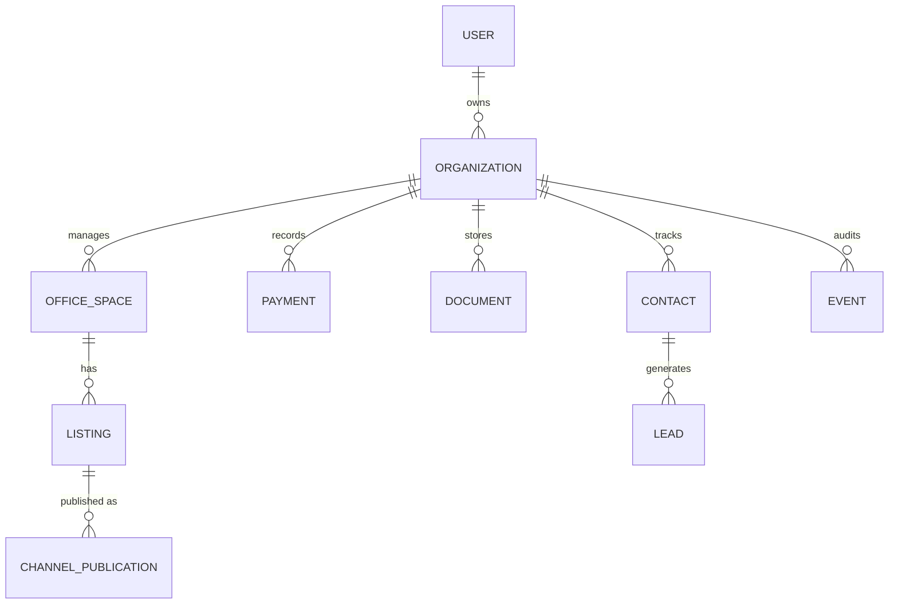

# Backend Endpoint Analysis & Spec v0.1

## Overview
This document defines the initial backend specification for the Office Management App. It replaces the legacy on-device database and prepares integrations with Avito and CIAN listings platforms.

## Domain Model


### Entity Dictionary
| Entity | Description |
|---|---|
| **User** | Account able to access one or more organizations. |
| **Organization** | Solo entrepreneur or company workspace. Default organization for single account. |
| **OfficeSpace** | Managed asset with photos, description, location, and attributes. |
| **Listing** | Commercial listing for an OfficeSpace. |
| **ChannelPublication** | Publication state of a Listing on Avito or CIAN. |
| **Payment** | Import or manual record of a financial transaction. |
| **Document** | Contract, invoice, or act stored for an organization. |
| **Contact** | Customer or lead contact information. |
| **Lead** | Inquiry from external channel with status and timeline. |
| **Event** | Audit log event emitted by backend. |

## Top Use Cases
1. Register and log in to manage organization.
2. Invite collaborator to organization.
3. Create and edit office spaces with photos.
4. Create listing for office space.
5. Publish listing to Avito.
6. Publish listing to CIAN.
7. Import bank statement CSV.
8. Record manual payment.
9. Match payment to document or counterparty.
10. Generate contract document from template.
11. Upload and preview signed contract.
12. Receive lead from Avito webhook.
13. Update lead status and add timeline comment.
14. Search office spaces by address or tags.
15. Paginate and filter payments by date or status.
16. View audit log for organization.
17. Configure webhook endpoint for events.
18. Refresh authentication token.
19. Archive outdated documents beyond retention policy.
20. Migrate local iOS data to backend resources.

## API Outline
| Resource | Method & Path | Description | Success Codes |
|---|---|---|---|
| Auth | `POST /auth/register` | Create account | `201` |
| | `POST /auth/login` | Obtain access & refresh tokens | `200` |
| | `POST /auth/refresh` | Refresh access token | `200` |
| Organizations | `GET /orgs` | List organizations | `200` |
| | `POST /orgs` | Create organization | `201` |
| | `GET /orgs/{id}` | Get organization | `200` |
| | `PATCH /orgs/{id}` | Update organization | `200` |
| | `DELETE /orgs/{id}` | Delete organization | `204` |
| OfficeSpaces | `GET /orgs/{orgId}/spaces` | List spaces | `200` |
| | `POST /orgs/{orgId}/spaces` | Create space | `201` |
| | `GET /orgs/{orgId}/spaces/{id}` | Get space | `200` |
| | `PATCH /orgs/{orgId}/spaces/{id}` | Update space | `200` |
| | `DELETE /orgs/{orgId}/spaces/{id}` | Delete space | `204` |
| Listings | `GET /orgs/{orgId}/spaces/{spaceId}/listings` | List listings | `200` |
| | `POST /orgs/{orgId}/spaces/{spaceId}/listings` | Create listing | `201` |
| | `POST /orgs/{orgId}/listings/{id}/publish` | Publish listing | `202` |
| Payments | `GET /orgs/{orgId}/payments` | List payments | `200` |
| | `POST /orgs/{orgId}/payments` | Create payment | `201` |
| Documents | `GET /orgs/{orgId}/documents` | List documents | `200` |
| | `POST /orgs/{orgId}/documents` | Upload document | `201` |
| Leads | `GET /orgs/{orgId}/leads` | List leads | `200` |
| | `POST /webhooks/avito` | Receive Avito webhook | `202` |
| Audit | `GET /orgs/{orgId}/events` | Audit log | `200` |

## Error Model
Errors follow [RFC7807](https://datatracker.ietf.org/doc/html/rfc7807) `application/problem+json` with fields:
```
{
  "type": "https://api.example.com/errors/validation",
  "title": "Invalid request",
  "status": 400,
  "detail": "Name is required",
  "instance": "/orgs/123"
}
```
Pagination uses `page` and `pageSize` parameters and returns `X-Total-Count` header. Sorting via `sort` query (`field,-otherField`). Filtering uses query parameters per field. Full-text search via `q` parameter where supported.

## AuthN/AuthZ
- Authentication: email + password now, optional OAuth in future.
- Tokens: JWT access (15m) and refresh (30d).
- Roles: `owner` (full control) and `collaborator` (limited to assigned organizations).

## Data Retention & PII
- Minimal personal data: name, email, phone for contacts and users.
- Documents retained 5 years then archived and anonymised.
- Leads and audit events kept 1 year.
- GDPR/152-FZ compliant deletion on request.

## Integration Contracts
- Avito & CIAN publications via background worker queue.
- Outgoing webhooks: delivery attempts with exponential backoff.
- Bank statement import supports standard CSV formats from major Russian banks.

## Local Data Mapping
| iOS Local Model | New Resource |
|---|---|
| `Building` | `Organization` (or `OfficeSpace` container) |
| `Office` | `OfficeSpace` |
| `Counterparty` | `Contact` |
| `Payment` | `Payment` |

## OpenAPI Draft
See [openapi.yaml](openapi.yaml) for a machine-readable specification covering ~80% of MVP scenarios.
